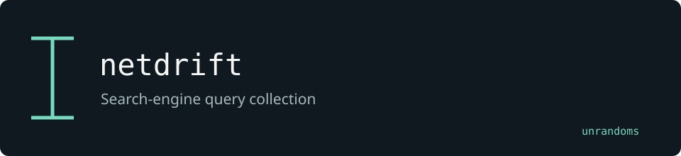

# netdrift

Queries internet search engines through a common interface. This fork adds Hunter.how and GreyNoise feeds and ASN query handling.

Maintained by [unrandoms](https://github.com/unrandoms), derived from [abuyv/exposor](https://github.com/abuyv/exposor).

## Fork-specific work

- [`exposor/feeds/hunterhow/hunterhow_feed.py`](exposor/feeds/hunterhow/hunterhow_feed.py)
- [`exposor/feeds/greynoise/greynoise_feed.py`](exposor/feeds/greynoise/greynoise_feed.py)
- [`exposor/feeds/query_builder.py`](exposor/feeds/query_builder.py)

## Validation and limits

Provider capabilities and credentials differ. An empty response does not establish that an asset is absent.

This documentation update does not certify all inherited features. The [archived reference](UPSTREAM_README.md) describes the original ecosystem; its package names and release links may target upstream rather than this fork.

## Credits

See [CREDITS.md](CREDITS.md) for the distinction between the original implementation and this fork's adaptations. Original licenses and copyright notices remain in the repository.
